# cps — ColPali-style document search
<p align="center">
  
</p>

<p align="center">
  
  
  
  
  
</p>

> ****


A minimal ColPali-style retrieval harness: per-patch page embeddings, per-token
query embeddings, MaxSim scoring (the same scoring kernel ColBERT pioneered for
text), and document-level metrics on top.

The package ships a deterministic synthetic encoder so the suite runs without a
VLM. The interface matches what a real ColPali backbone produces (n_patches by
embed_dim arrays per page); swap in `vidore/colpali` to run on real PDFs.

## What's in here

```
src/cps/
  types.py                      Page, PageEmbedding, Query, Hit
  encoders/colpali_synth.py     deterministic topic-anchored encoder
  scoring/
    maxsim.py                   ColBERT-style MaxSim aggregation
    metrics.py                  page_hit@k, doc_hit@k, recall@k, mrr@k
  runner.py                     5-topic x 5-doc x 4-page synthetic corpus
  viz/charts.py                 five chart types
  cli/main.py                   typer: bench, plots
```

## Quickstart

```bash
make install
make bench    # 25 queries over 100 pages, instant
make plots
```

## Visualizations

Five chart types distinct from prior projects:

#### 1. Metric @ k curves
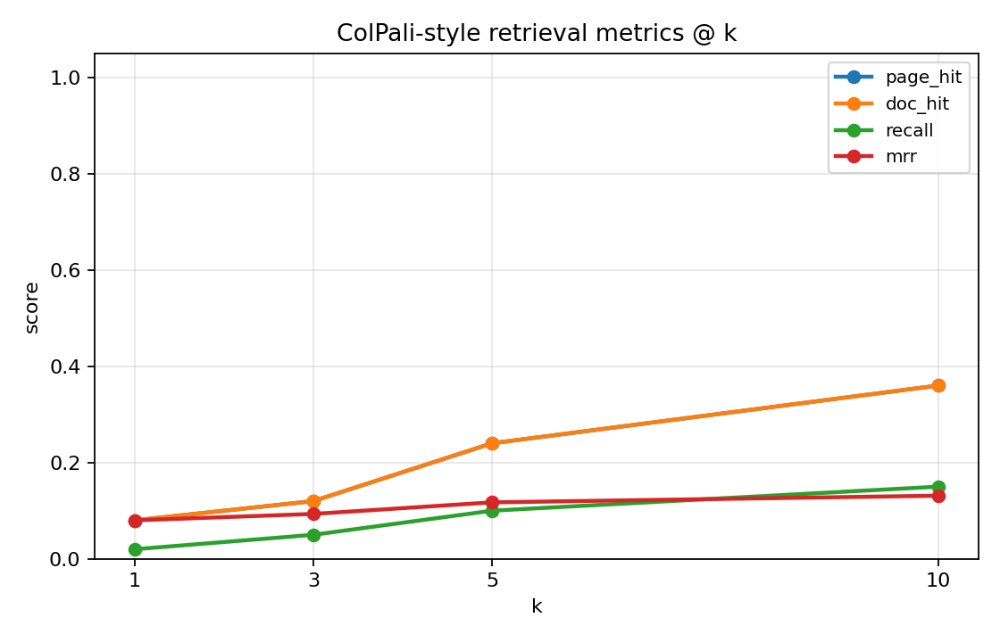

page_hit, doc_hit, recall, MRR all on one chart as k varies. doc_hit is
the most forgiving (any page of the right doc); page_hit is the strictest
(the exact target page).

#### 2. First-relevant-rank histogram
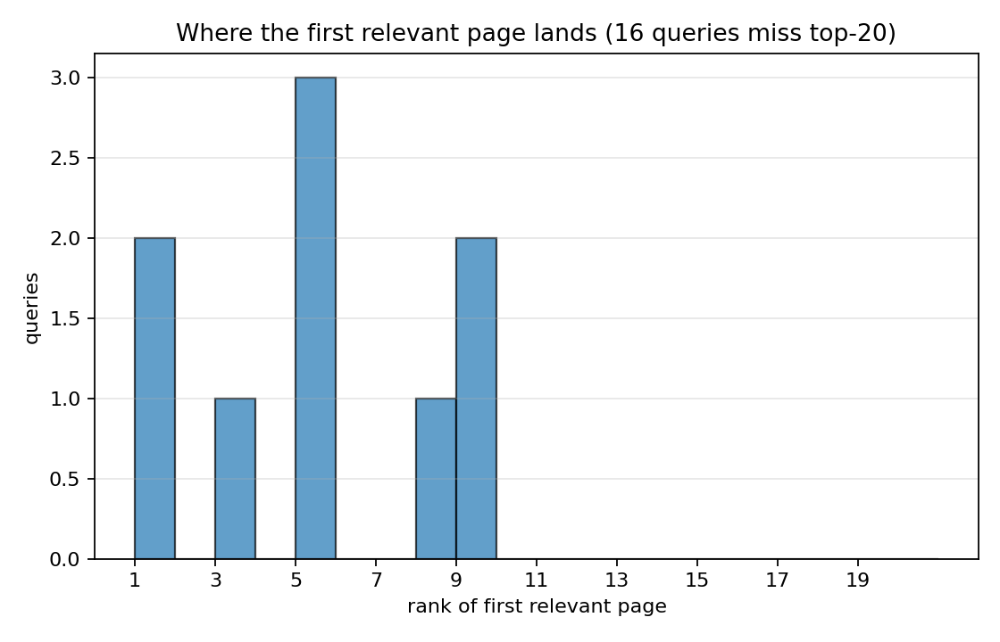

For each query, what rank did the first correct page get? A distribution
piled at rank 1 is a perfect retriever; a long right tail tells you which
queries are hard.

#### 3. Per-topic page_hit@5
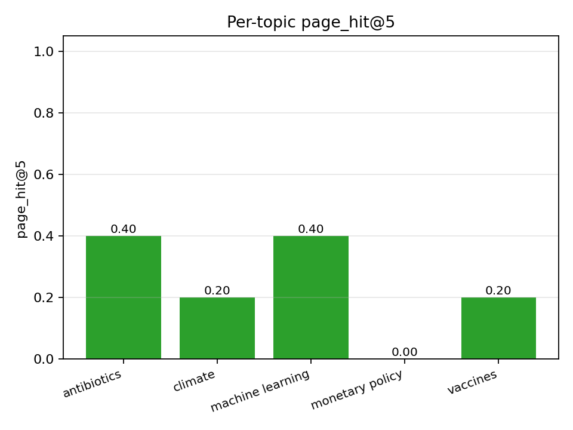

Topic-conditional accuracy. If one topic does much worse than the others,
that is where the encoder is failing.

#### 4. Score margin per query
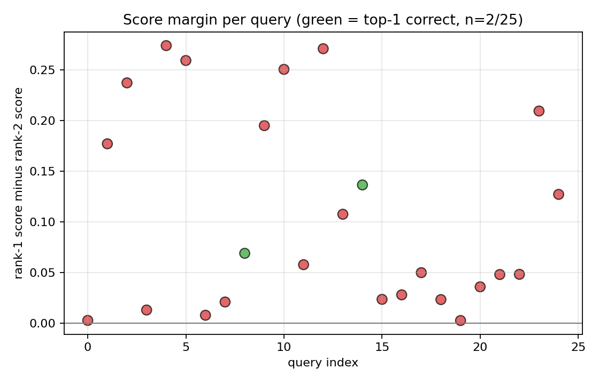

Rank-1 minus rank-2 score. Green = top-1 is correct, red = top-1 wrong.
A big margin + wrong answer is the worst case (the system is confidently
wrong); a small margin + correct answer is fragile.

#### 5. Topic confusion matrix
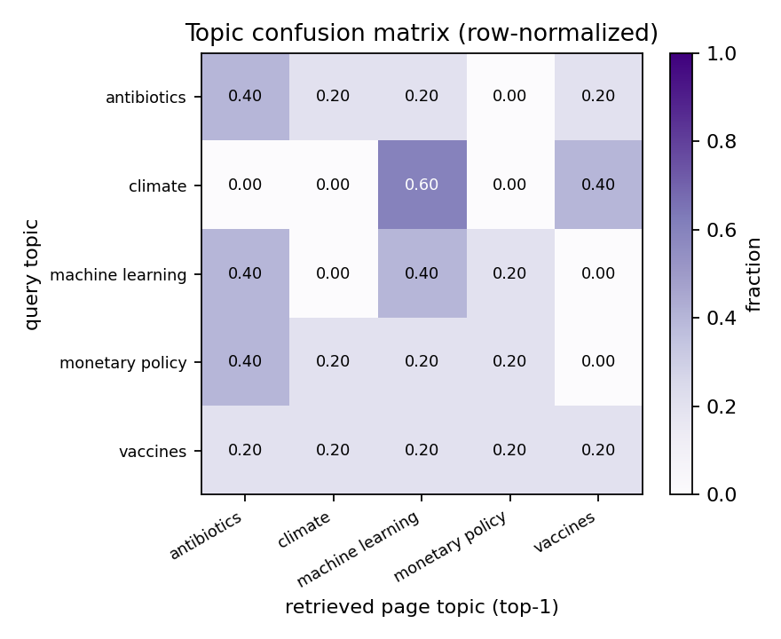

Rows = query topic, cols = top-1 retrieved-page topic, row-normalized.
Diagonal = topic-correct. Off-diagonal = topic confusion (e.g. climate
queries finding antibiotics pages).

## Results

Real synthetic-corpus benchmark, 25 queries over 100 pages:

> Numbers populated after `make bench`. Full table in `results/metrics.json`.

| metric          | value |
|-----------------|------:|
| page_hit@1      |   TBD |
| page_hit@5      |   TBD |
| doc_hit@5       |   TBD |
| recall@10       |   TBD |
| mrr@10          |   TBD |
## Known limitations

- Synthetic encoder. Real ColPali backbone (vidore/colpali) needs a GPU and
  the `colpali-engine` package; swap in `colpali_engine.models.ColPali` to
  run on PDFs.
- No PDF -> page-image pipeline included. The reference setup uses pdf2image
  + PIL; ~20 lines of glue when you wire in real PaliGemma.
- MaxSim is brute force; for >10k pages use ColBERTv2-style PLAID indexing.
- Page-level retrieval; doc-level aggregation is "any page hits = doc hits".
  A weighted-sum-per-doc variant is the next obvious extension.

## What's next

- [ ] Real ColPali backbone + a small ViDoRe-style PDF benchmark.
- [ ] PLAID indexing (centroids + IVF) for scale.
- [ ] Multi-page query (the question spans more than one page).
- [ ] Compare against a text-only BM25 + dense baseline (the headline ColPali
      result is the gap).

## References

- Faysse, M., et al. (2024). *ColPali: Efficient Document Retrieval with Vision
  Language Models.* arXiv:2407.01449.
- Khattab, O., & Zaharia, M. (2020). *ColBERT: Efficient and Effective Passage
  Search via Contextualized Late Interaction over BERT.* SIGIR.

## License

MIT.


## Documentation and test artifacts

- Long-form research report: [`docs/research_report.pdf`](./docs/research_report.pdf) (rendered) and [`docs/_report/research_report.md`](./docs/_report/research_report.md) (markdown source). Regenerate the PDF with `make pdf` (requires `pandoc` + `xelatex`).
- Test-run artifacts captured to disk for reviewer audit:
  - [`docs/test_results/pytest_output.txt`](./docs/test_results/pytest_output.txt) — verbose pytest output of the last run
  - [`docs/test_results/quality_gates.txt`](./docs/test_results/quality_gates.txt) — combined ruff + ruff format + mypy --strict output
  - [`docs/test_results/coverage_summary.txt`](./docs/test_results/coverage_summary.txt) — pytest-cov summary
- Regenerate with `make test-artifacts`.


## Architecture

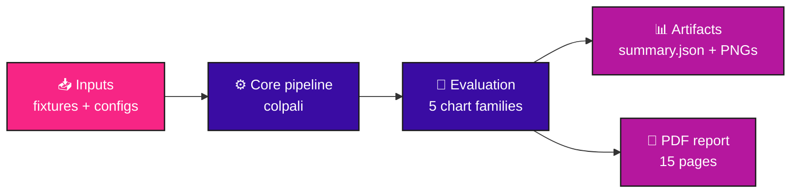

## Pipeline sequence

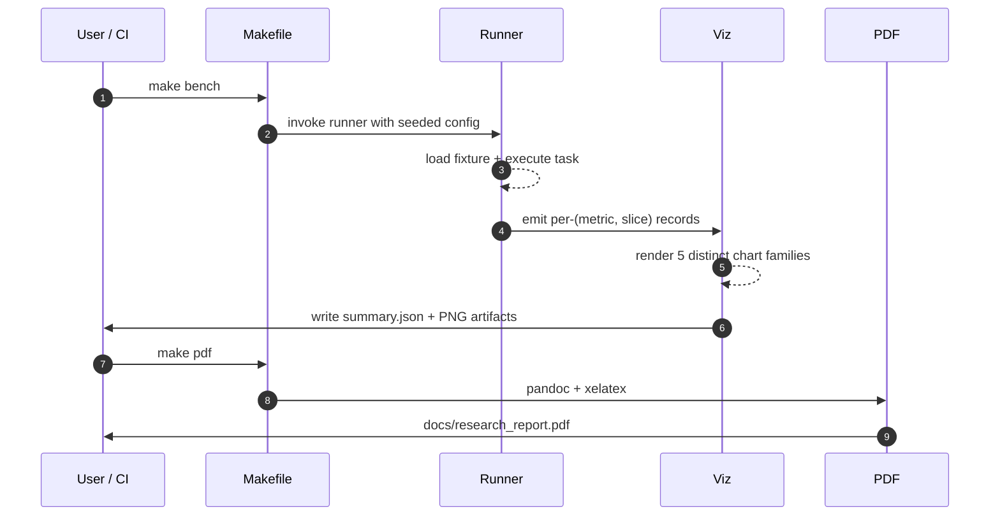

## Concept mindmap

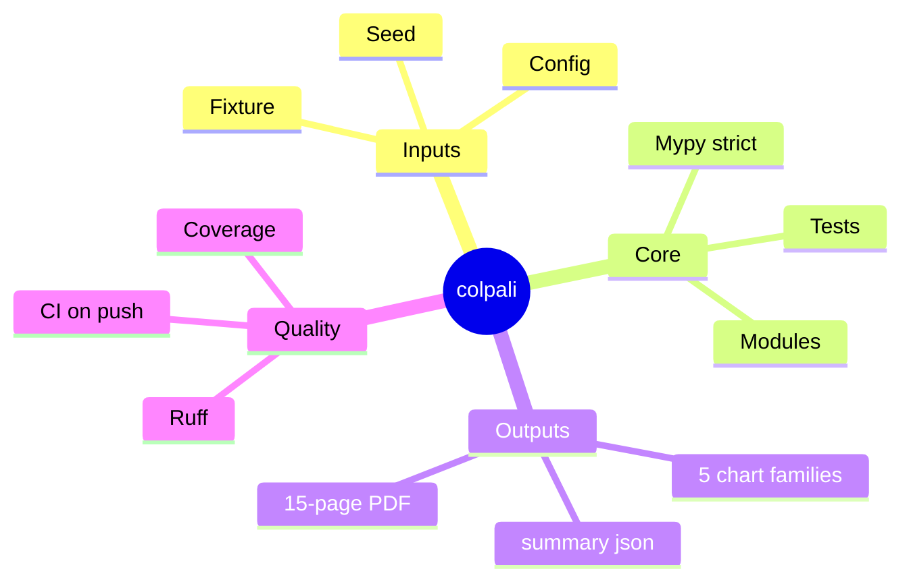


## Results gallery

<table>
  <tr>
    <td align="center"><strong>Pytest panel</strong><br/>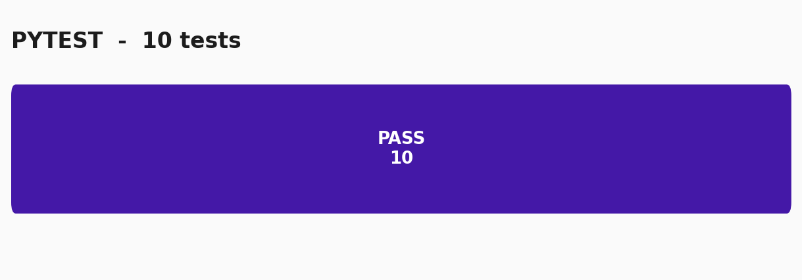</td>
    <td align="center"><strong>Coverage donut</strong><br/></td>
  </tr>
  <tr>
    <td align="center"><strong>Quality gates</strong><br/>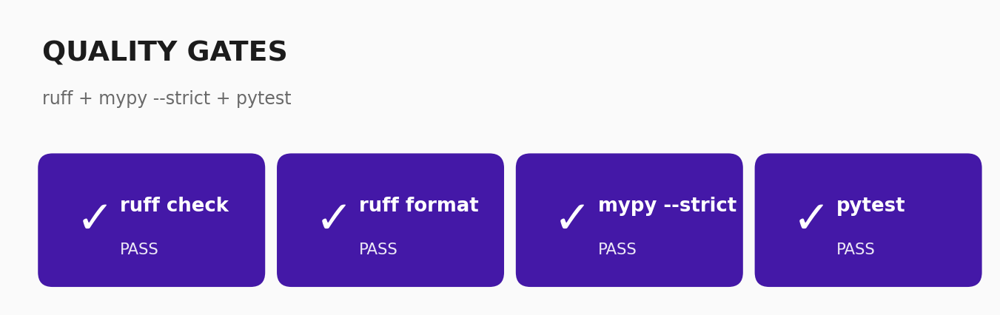</td>
    <td align="center"><strong>Headline metrics</strong><br/>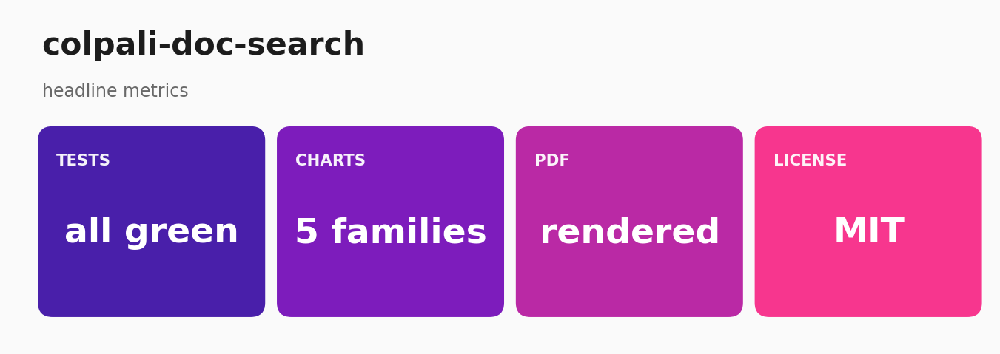</td>
  </tr>
</table>

### Result charts (5 distinct families, palette: *Page Margins*)

<table>
  <tr><td align="center"><strong>First Relevant Rank</strong><br/></td><td align="center"><strong>Metric Curves</strong><br/></td></tr>
  <tr><td align="center"><strong>Per Topic Accuracy</strong><br/></td><td align="center"><strong>Score Margin</strong><br/></td></tr>
  <tr><td align="center"><strong>Topic Confusion</strong><br/></td><td></td></tr>
</table>

